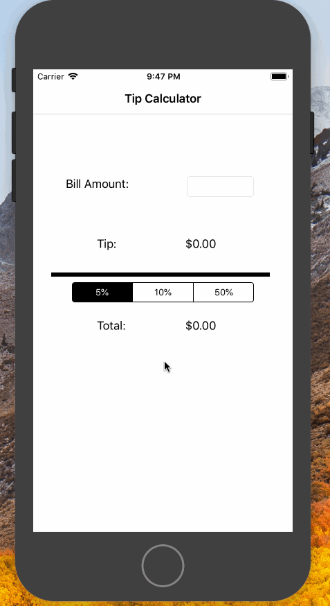

# **Tip**

## Description
 Tip is a simple IOS tipping calculator app that allows you to input the bill amount and calculate the tip based on a selected percentage.
 This project was made using the Xcode IDE and was programmed using the swift programming language.
 
# Technologies Used
- Xcode IDE
- Swift

## App Demo
Here's a walkthrough of this simple app:

GIF created with [LiceCap](http://www.cockos.com/licecap/).

## License

    Copyright [2020] [Johann Olivares]

    Licensed under the Apache License, Version 2.0 (the "License");
    you may not use this file except in compliance with the License.
    You may obtain a copy of the License at

        http://www.apache.org/licenses/LICENSE-2.0

    Unless required by applicable law or agreed to in writing, software
    distributed under the License is distributed on an "AS IS" BASIS,
    WITHOUT WARRANTIES OR CONDITIONS OF ANY KIND, either express or implied.
    See the License for the specific language governing permissions and
    limitations under the License.
